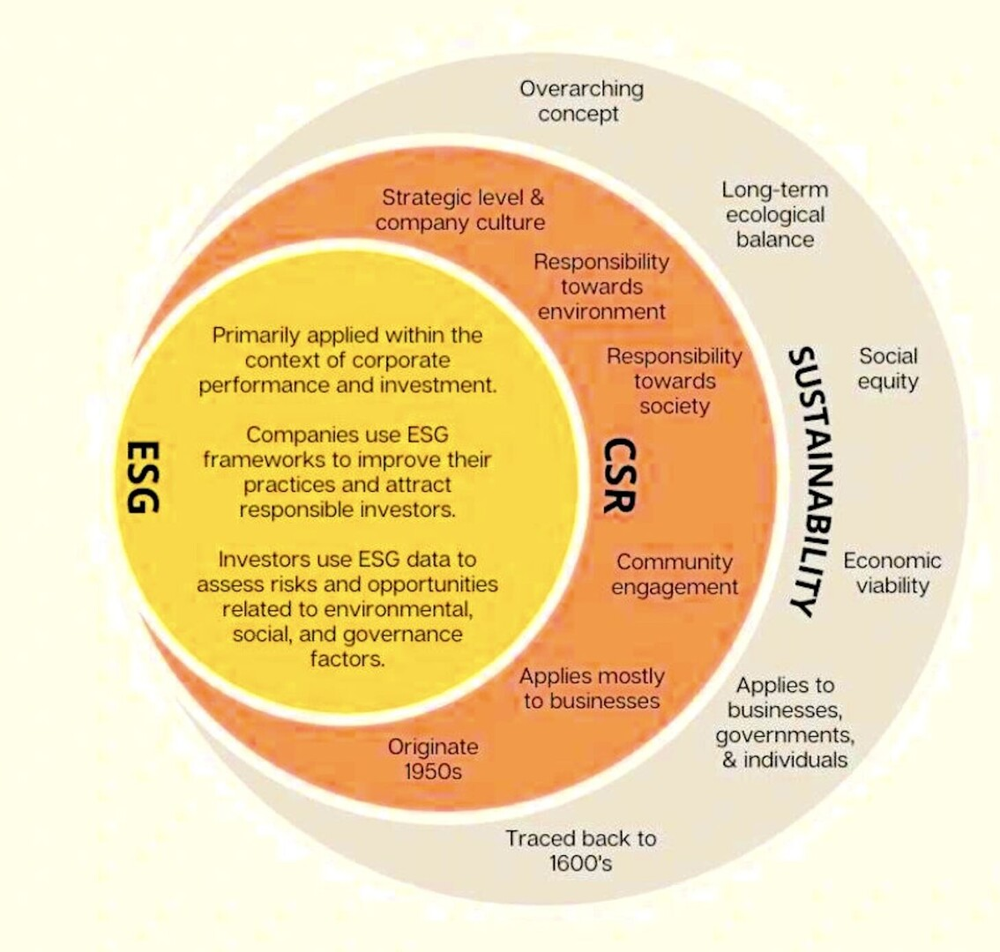

<!-- description: Business Ethics, Corporate Social Responsibility and Sustainability Management -->

<!-- _class: title -->

# Responsibility

## Business Ethics, Corporate Social Responsibility and Sustainability Management

IMC University of Applied Sciences Krems, Austria
Roman Mesicek

SAI Part 2

---
<!-- _class: chapter -->
# Business Ethics
## The challenge of ethical decision making

---

# What is Business Ethics?

Business ethics is the study of business situations, activities, and decisions where issues of right and wrong are addressed.

<!-- ---

# Why is business ethics it important?

## **Goal**: Explore the importance of business ethics in modern organizations.

 -->
--- 

# Why is business ethics important?

- Advances our understanding of the right and wrong in business
- Corporate scandals in the world
- Evolving nature of the job role of managers and management education
- Personal level of business ethics
- Addresses the power and influence in society
- Brings significant benefits to organizations
- Positive CSR or business ethics yields better performance

---

# Defining morality, ethics and ethical theory

- **Morality**: (norms, values, beliefs) embedded in social processes, which define right and wrong for an individual or a community
- **Ethics**: study of morality and the application of reason to elucidate specific rules and principles that determine right and wrong for a given situation. These rules and principles are called ethical theories
- **Ethical theories**: the rules and principles that determine right and wrong for a given situation

---

# Ethics and the law

- Law can be defined as a system of rules that are enforced through social institutions to govern behaviour
- If something is not illegal does not mean that this is ethical
- Law is the 'floor' of acceptable behavior
- Ethics deals with the 'grey' areas of business

---

# Examples for ethical issues in the context of a multinational business I

- Employees
  - Working conditions, job design, wages, work-life balance
- Customers
  - Marketing and sales policies, product safety, pricing
- Competitors
  - Anti-competitive behaviour, industrial espionage

---

# Examples for ethical issues in the context of a multinational business II

- Suppliers
  - Comparable prices, timely payments of invoices, preferential treatment
- Civil Society (pressure groups, NGOs, local communities)
  - Respecting local customs and norms, accountability and transparency, gentrification
- Government and Regulation
  - Taxation, provision of information, lobbying

---

# Ethical values in large multinational companies    

Based on a publication defining and measuring organizational values.

###### Junxion “Value Based Culture“, 2025

---

# Ethical values expected by employees    

Results of an employee surveys meta study.

- Trust and integrity
- Transparency
- Fairness
- Responsibility
- Caring 
- Compassion
- Respect
- Citizenship
- Courage
- Honesty

###### Employee expectations study, Global Tolerance, 2015

---

# Relationship Business Ethics and Sustainable Development

Sustainability can be seen as a key goal of business ethics – in the sense, that ethical behaviour is also social, ecological and economic responsible behaviour and good for the society.

---

# The Triple Bottom Line

The phrase „the triple bottom line“ was first coined in 1994 by John Elkington. 

One is the traditional measure of corporate profit—the “bottom line” of the **„profit“** and loss account. The second is the bottom line of a company‘s **„people“** account—a measure in some shape or form of how socially responsible an organisation has been throughout its operations. The third is the bottom line of the company‘s **„planet”** account—a measure of how environmentally responsible it has been. 

---
<!-- _class: chapter -->
# Corporate Social Responsibility

## The responsibility of corporations for their impact on society

---

# Why do corporations have social responsibilities?

**Moral reasons** "THE MORAL CASE"
- Corporations cause social problems
- Corporations should use their power responsibly
- All corporate activities have some social impacts
- Corporations rely on the contribution of a wide set of - stakeholders in society, not just shareholders

**Business reasons** (‘enlightened self-interest’) 
"THE BUSINESS CASE"
- Extra and/or more satisfied customers
- Employees may be more attracted/committed
- Forestall legislation
- Long-term investment which benefits corporation 

---

# CSR – What is this?

An [Introduction by Thomas Beschorner (University of St.Gallen, 2012)](https://www.youtube.com/watch?v=E0NkGtNU_9w).

- CSR = Corporate Social Responsibility
- Good business for a good society – today and tomorrow
- CSR is not charity – it is about how companies earn their profits.
- It takes employees of integrity and appropriate organisational structure to realize CSR - It is a matter of individual and institutional ethics.
- Soft law and governance mechanisms based on companies self commitment.

---

# CSR Pyramid

The first theoretical framework for corporate social responsibility.

###### Source:  Carroll, A.B.: The Pyramid of Corporate Social Responsibility, in: Business Horizons, Bd. 34 (1991), Nr. 4, S. 42.

---

# The Path to CSR (Zadek 2004)

Using the theory of organizational learning Simon Zadek introduced a stage model to help categorize the level of corporate social responsibility maturity in companies

---

# CSR according to ISO 26000

Definition according to the International Standardisation Organisation (ISO) standard on Social Responsibility (ISO 26000 Social Responsibility).

---

# What are common motives for responsible business practices?

**Moral case**
- Ethical motivations of owners or executive management
- Societal expectations with regard to repsonsible behavour
- Responsibility for global challenges and future generations

**Business case** 
- Increased competitiveness (e.g. cost reduction, productivity, innovation)
- Differentiation (e.g. supply chain, reputation, products and services)
- Capital access (e.g. through better ratings)

- Risk reduction (e.g. legal, reputation, HR)
- Customer loyalty
- Regulatory compliance
- Brand value
- Attractiveness as an employer and employee loyalty

###### Adapted from Porter & Kramer (2006), PWC (2016) and Faber-Wiener (2011)

---

# Example "Motives": Lego

"Everything is NOT awesome": Global campaign to ditch Shell as marketing partner led to more than 1 million people asked Lego to end its partnership.

---

# Example "Motives": Erste Bank

Zweite Sparkasse (second chance banking for people facing financial exclusion)

---

# Example "Motives":  Innocent

1999 founded: "Healthy drinks on campus"

---

# Example "Motives":  Unilever

- Unilever "Sustainable Living" Brands (26 brands)
- Purpose-led Brands
- Growing brands

---
<!-- _class: chapter -->
# Sustainability Management
## Integrating social and ecological issues in operation

---

# Relation between Sustainability, CSR and ESG concepts

---
# The value chain view of the company

**Supply chain:** Sequence of activities or parties that provides products or services to the organization.

**Value chain:** Entire sequence of activities or parties that provide or receive value in the form of products or services. 
- Parties that provide value include suppliers, outsourced workers, contractors and others. 
- Parties that receive value include customers, consumers, clients, members and other users.

The value chain is used as a **framework** to identify the positive and negative social impact of a companies activities (“inside-out”) as well as the influences on the business (outside-in”).

---

# The concept of materiality

Relevant for strategy, operations and reporting

---

# Principles of social responsibility

These are the **principles for businesses** based in the ISO 26000.

- Accountability
- Transparency
- Ethical behaviour
- Respect for stakeholder interests
- Respect for the rule of law
- Respect for international norms of behaviour
- Respect for human rights

Full structure it the ISO 26000:

###### Image source: ISO 26000

---

# Topics of social responsibility

These are the **7 core subjects** according to the ISO 26000.

###### Image source: ISO 26000

---

# Topics of sustainability reporting

These are the **core sustainability topics** according to the European Sustainability Reporting Standard (ESRS) version from 2025.

###### Image source: EFRAG

---

# Stakeholder Engagement

## Who or what is a Stakeholder?

The concept of **"Stakeholder Theory"** was defined by R. Edward Freeman in 1984 and can be sumarised as "The Purpose of the corporation should be defined as creating value for all of it's stakeholders".

[Introduction to the topic (Institute for Corporate Ethics, 2009)](https://www.youtube.com/watch?v=bIRUaLcvPe8).

---

# Stakeholder Engagement: Core Concepts

The term "Stakeholder Management" is used for the internal processes and "Stakeholder Engagement" refers more generally to the overall processes including the interaction.

- **Stakeholders**: individuals, groups or organizations that can affect, be affected by, or perceive themselves to be affected by a decision or activity
- **Engagement**: interaction between an organization and its stakeholders
- **Influence/Impact**: How stakeholders affect the organization and vice versa
- **Materiality**: Most significant impacts and dependencies

---

# Why Stakeholder Engagement Matters

A combination of moral and business case arguments.

- **Risk Management:** Identify and mitigate risks early
- **Innovation:** Gain insights for new products/services
- **Reputation:** Build trust and credibility
- **Compliance:** Meet regulatory and social expectations
- **Competitive Advantage:** Differentiate through strong relationships
- **Social License:** Secure permission to operate
- **Value Creation:** Generate shared value for all parties

---

# Excerpt from the AA1000SES

The Accountabilty Stakeholder Engagement Standard

**Purpose, scope and stakeholders**

**Level of engagement**

###### Image sources: AA1000SES
---

# Keys to Success in Stakeholder Engagement

- **Authenticity**: Genuine interest in stakeholder views
- **Transparency**: Clear about objectives and limitations
- **Responsiveness**: Act on feedback received
- **Flexibility**: Adapt approach as needed
- **Leadership Commitment**: Top management support
- **Integration**: Link to core business processes
- **Long-term Perspective**: Build lasting relationships

---
<!-- _class: chapter -->
# Maturity
## Measuring the maturity of sustainability and responsibility in businesses 

---

# Maturity assessment
According to the Business Sustainability 3.0 concept.

An [Introduction by Thomas Dyllick (University of St.Gallen, 2016)](https://www.youtube.com/watch?v=AEFqUh4PMmI).

---

# Business Sustainability 3.0 Typology

###### Thomas Dyllick and Kathrin Muff (2015)

